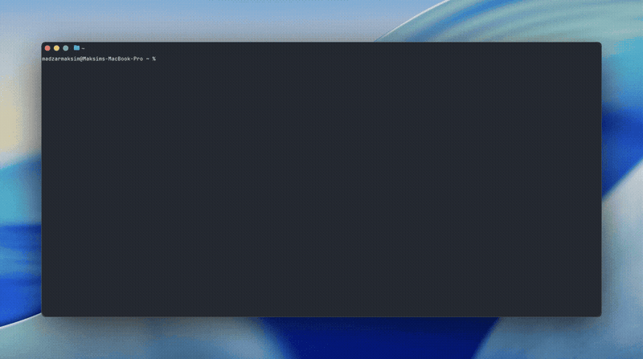

# ccsearch

Claude Code is an amazing tool, but finding past sessions is terrible. The built-in `--resume` picker only gives you a flat list of your last ~50 sessions with no way to search. If you want to find that one specific refactoring conversation from last Tuesday, you're out of luck.

**`ccsearch` fixes this.** It's a lightning-fast, searchable UI for your Claude Code history. Type what you remember, hit Enter, and it instantly drops you back into the chat.



## Why use ccsearch?

* **Smart Search:** It doesn't just look for exact text. It understands concepts. Search "database" and it will surface your chat about "Postgres".
* **One-Key Resume:** This isn't just a search engine, it's a launcher. Find your session, hit `Enter`, and it automatically runs `claude --resume <id>` for you.
* **Zero Maintenance:** It detects new and changed chats in your local Claude history before each search. You never have to manually re-index.
* **Private & Local:** All data and search models live entirely on your local machine. Nothing is sent to the cloud.

## Installation

**Homebrew (macOS & Linux)**
```bash
brew install madzarm/tap/ccsearch
```

**Shell script (macOS & Linux)**
```bash
curl -fsSL https://raw.githubusercontent.com/madzarm/ccsearch/master/install.sh | sh
```
*(To install to a custom directory, prepend `INSTALL_DIR=~/.local/bin`)*

**Windows (PowerShell)**
```powershell
irm https://raw.githubusercontent.com/madzarm/ccsearch/master/install.ps1 | iex
```

**From source (requires Rust)**
```bash
cargo install --git https://github.com/madzarm/ccsearch.git
```

## Quick Start

You don't need to manually index on your first run, just start searching:

```bash
# Search your sessions (drops you into an interactive TUI)
ccsearch "authentication bug"
```

### Advanced Usage

```bash
# List your recent sessions from the last week
ccsearch list --days 7

# Search with plain text output (no UI, great for scripting)
ccsearch search "refactor database" --no-tui --json

# Re-index all your sessions manually (optional)
ccsearch index
```

## TUI Controls

| Key | Action |
| --- | --- |
| `↑/↓` or `j/k` | Navigate results |
| `Enter` | **Resume selected session** (launches `claude --resume`) |
| `/` | Filter within results |
| `g/G` | Jump to top/bottom |
| `q/Esc` | Quit |

---

## Under the Hood (For the Curious)

If you care about how the search actually works, `ccsearch` uses a local hybrid search architecture to guarantee highly relevant results:

* **Keyword (BM25):** Queries a local SQLite FTS5 index for exact word matches. Perfect for finding specific variable names or errors.
* **Semantic (Vector):** Embeds your query using `all-MiniLM-L6-v2` (a lightweight 384-dim model downloaded on first use) to find conceptually related sessions via cosine distance.
* **Fusion (RRF):** Merges both results using Reciprocal Rank Fusion, giving you a single, highly accurate ranked list. Works gracefully with BM25-only if the embedding model is unavailable.

### Commands & Configuration

**`ccsearch search <query>` (or just `ccsearch <query>`)**
| Flag | Default | Description |
| --- | --- | --- |
| `--days N` | `30` | Only search sessions from last N days |
| `--project PATH`| | Filter to a specific project directory |
| `--limit N` | `20` | Max results to display |
| `--no-tui` | | Print results directly to stdout |
| `--json` | | Output in JSON format |

**Data Storage:**
* Index: `~/.ccsearch/index.db` (SQLite + vectors)
* Models: `~/.ccsearch/models/` (~80MB ONNX model)
* Config: `~/.ccsearch/config.toml`

### Development

```bash
cargo test
cargo clippy -- -D warnings
cargo fmt
cargo build --release
```

**License**
MIT
